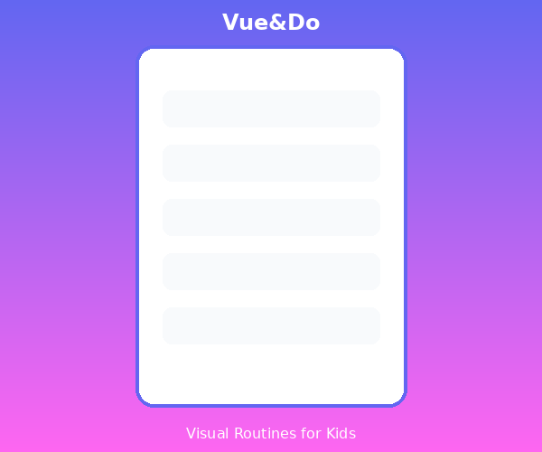

# Image Assets for Vue&Do Website

This directory contains all image assets for the marketing website.

## Required Images

### 1. Hero Section Mockup
**File**: `hero-mockup.png`
**Dimensions**: 600x500px (or 1200x1000px for retina)
**Format**: PNG or WebP
**Description**: Product screenshot showing Vue&Do's interface with a personalized comic strip routine

**Content Ideas**:
- Show the kiosk mode with a morning routine
- Display 4-6 panels of a comic strip
- Feature child-friendly avatars
- Show large "Doing" and "Done" buttons
- Include visual rewards (confetti, sparkles)

### 2. Open Graph Image
**File**: `og-image.png`
**Dimensions**: 1200x630px
**Format**: PNG
**Description**: Social media preview image for Facebook, LinkedIn, etc.

**Content Requirements**:
- Vue&Do logo
- Tagline: "Transform Daily Routines into Personalized Visual Stories"
- Visual element: Comic strip panel or child with tablet
- Brand colors: Calming blue (#2196F3)
- Text should be readable at small sizes

### 3. Twitter Card Image
**File**: `twitter-card.png`
**Dimensions**: 1200x600px
**Format**: PNG
**Description**: Twitter-specific preview image

**Content**: Similar to OG image but wider aspect ratio

### 4. Favicons
**Files**:
- `favicon-32x32.png` (32x32px)
- `favicon-16x16.png` (16x16px)

**Format**: PNG
**Description**: Browser tab icons

**Content**: Simplified Vue&Do logo or icon
- Keep it simple and recognizable at small sizes
- Use brand colors
- Consider an abstract "V" or visual schedule icon

### 5. Apple Touch Icon
**File**: `apple-touch-icon.png`
**Dimensions**: 180x180px
**Format**: PNG (no transparency)
**Description**: iOS home screen icon

**Content**:
- Vue&Do logo on solid background
- No transparency (iOS adds its own rounded corners)
- Ensure good contrast
- Test how it looks with iOS rounded corners

## Image Optimization

Before adding images to the website:

1. **Compress**: Use TinyPNG, ImageOptim, or Squoosh
2. **Format**: Consider WebP for better compression (with PNG fallback)
3. **Responsive**: Create multiple sizes if needed (1x, 2x for retina)
4. **Alt Text**: Always provide descriptive alt text in HTML

## Tools for Creating Images

### Screenshots
- Use browser DevTools device emulation
- Figma or Sketch for mockups
- Add realistic content (not lorem ipsum)

### Social Images
- Canva (templates available)
- Figma (design from scratch)
- Adobe Photoshop/Illustrator

### Compression
- [TinyPNG](https://tinypng.com/) - Free PNG/JPEG compression
- [Squoosh](https://squoosh.app/) - Google's image optimizer
- ImageOptim (Mac) - Drag-and-drop optimization

### Icons/Favicons
- [Favicon.io](https://favicon.io/) - Generate from text/image
- [RealFaviconGenerator](https://realfavicongenerator.net/) - Comprehensive favicon generator

## Image Checklist

Before deploying:

- [ ] hero-mockup.png created and optimized
- [ ] og-image.png created (1200x630px)
- [ ] twitter-card.png created (1200x600px)
- [ ] favicon-32x32.png created
- [ ] favicon-16x16.png created
- [ ] apple-touch-icon.png created (180x180px)
- [ ] All images compressed
- [ ] All images have descriptive filenames
- [ ] Alt text added to HTML for all images
- [ ] Images tested on various devices/screens
- [ ] Social preview tested (Twitter Card Validator, Facebook Debugger)

## Placeholder Images

Until final images are ready, you can use:

1. **Placeholder Services**:
   - https://via.placeholder.com/600x500?text=Vue%26Do+Hero
   - https://placehold.co/1200x630/2196F3/FFFFFF?text=Vue%26Do

2. **Temporary Files**:
   - Create simple colored rectangles with text
   - Use design system colors (#2196F3, #E3F2FD)

## Brand Guidelines

When creating images, follow these guidelines:

**Colors** (from design system):
- Primary Blue: #2196F3
- Light Blue: #E3F2FD
- Success Green: #4CAF50
- Neutral White: #FFFFFF
- Text Dark: #212121

**Typography**:
- Headlines: Comic Neue Bold
- Body: System font stack
- Minimum size: 16px for readability

**Style**:
- Clean, minimalist
- Child-friendly and warm
- Professional yet approachable
- Consistent with neuro-inclusive design principles

## Testing Social Images

After creating social media images, test them:

1. **Twitter**:
   - [Twitter Card Validator](https://cards-dev.twitter.com/validator)

2. **Facebook/LinkedIn**:
   - [Facebook Sharing Debugger](https://developers.facebook.com/tools/debug/)

3. **General**:
   - [Metatags.io](https://metatags.io/) - Preview all social cards

## Copyright & Licensing

- Only use images you have rights to
- If using stock photos, ensure commercial license
- Credit photographers if required
- For child photos: obtain proper consent (especially for neuro-diverse children)
- Consider privacy implications (use avatars, not identifiable children)

## Accessibility

All images must have:
- Descriptive alt text
- Sufficient contrast if text overlays
- Not rely on color alone to convey meaning
- Be understandable when described to screen reader users

Example alt text:
```html

```

## Future Assets

As the product evolves, you may need:
- Feature screenshots (individual features)
- Team photos (about page)
- Research/testimonial images
- App store screenshots
- Video thumbnails
- Icon sets for features

---

**Need help?** Contact the design team or refer to `/home/dam/VueDo/design-system/` for brand guidelines.
